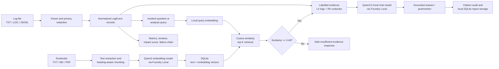

# FaultTrace

**A fully local, evidence-grounded incident analysis and postmortem assistant built with Microsoft Foundry Local.**

Developed as part of the **Microsoft AI Innovators Internship / Summer School** program.

FaultTrace parses software logs, reconstructs a failure chain, retrieves relevant operational runbooks, and generates source-grounded answers or postmortems without sending incident data to a cloud API. It is designed as a compact offline RAG project for environments where logs and internal procedures are sensitive.

> Project status: functional MVP. The application, local RAG pipeline, evaluation suite, and automated tests are working. The code and default dependency set are cross-platform; the current release has been verified on Windows.

## Why FaultTrace?

Operational teams often have two disconnected evidence sources: raw incident logs and human-written runbooks. FaultTrace connects them while keeping three boundaries explicit:

- **Observed facts** come from labelled log lines such as `[L7]`.
- **Operational guidance** comes from retrieved runbook sections such as `[R1]`.
- **Unsupported questions** are rejected before the chat model runs.

The language model was **not trained or fine-tuned** for this project. FaultTrace uses retrieval-augmented generation (RAG), so new knowledge can be added by indexing a document rather than retraining a model.

## Features

- Parses plain-text logs and JSONL with common timestamp, severity, service, and message aliases.
- Reports malformed non-empty lines instead of silently dropping them.
- Masks emails, IP addresses, bearer tokens, API keys, passwords, and secrets locally.
- Calculates an explainable 0–100 operational impact score.
- Displays severity charts, service distribution, a timeline, and a deterministic failure chain.
- Ingests TXT, Markdown, and text-based PDF runbooks up to 10 MB.
- Splits documents by headings and paragraph-aware chunks of at most 1,400 characters.
- Creates embeddings with a local Foundry model and stores text plus vectors in SQLite.
- Performs top-K semantic retrieval using cosine similarity.
- Produces instant deterministic analysis or a deeper local-LLM postmortem.
- Answers free-form incident questions with `[L#]` and `[R#]` citations.
- Rejects weakly supported questions with a calibrated relevance threshold.
- Audits generated citation labels against the evidence supplied to the model.
- Measures retrieval, LLM generation, and end-to-end latency separately.
- Saves generated reports locally and exports them as Markdown.

## Architecture



No external inference API is used. Foundry Local models must be downloaded once during setup; after they are cached, inference and document processing run on-device.

## Models and storage

| Component | Implementation |
|---|---|
| Embeddings | `qwen3-embedding-0.6b` through Microsoft Foundry Local |
| Chat generation | `qwen3.5-2b-text` through Microsoft Foundry Local |
| Vector search | In-process cosine similarity, top K = 3 |
| Relevance gate | Best similarity must be at least `0.48` |
| Persistence | SQLite (`knowledge_chunks` and `incident_reports`) |
| User interface | Streamlit + Plotly |

The `0.48` threshold was calibrated on the bundled knowledge base: supported evaluation queries scored approximately `0.56–0.85`, while an unrelated HR-policy query scored `0.279` and was rejected.

## Requirements

- Windows, macOS (Apple silicon), or Linux supported by Microsoft Foundry Local
- Python 3.11 or later (the project was developed with Python 3.13.14)
- 16 GB RAM recommended
- Microsoft Foundry Local-compatible hardware/runtime
- Internet access for initial Python dependency and model download only

The default `requirements.txt` uses Microsoft's cross-platform `foundry-local-sdk` package. Windows users may instead use `requirements-winml.txt` for the Windows ML accelerated backend. Install only one SDK variant in an environment.

## Installation

Create a virtual environment from the project directory.

Windows PowerShell:

```powershell
python -m venv .venv
.\.venv\Scripts\Activate.ps1
python -m pip install --upgrade pip
python -m pip install -r requirements.txt
```

macOS or Linux:

```bash
python3 -m venv .venv
source .venv/bin/activate
python -m pip install --upgrade pip
python -m pip install -r requirements.txt
```

On Windows, the optional hardware-accelerated SDK can be selected in a fresh environment with:

```powershell
python -m pip install -r requirements-winml.txt
```

Build the bundled runbook index. The first run downloads the embedding model if it is not already cached:

```bash
python scripts/build_knowledge_base.py
```

Start the application:

```bash
python run_faulttrace.py
```

Then open [http://127.0.0.1:8501](http://127.0.0.1:8501). `run_faulttrace.py` uses the active Python interpreter on Windows, macOS, and Linux. The optional `START_FAULTTRACE.bat` remains available as a Windows convenience shortcut.

## Usage

1. Select a bundled incident or upload a TXT, LOG, JSON, or JSONL log.
2. Review the impact score, charts, deterministic failure chain, and raw timeline.
3. Open **Knowledge Base** to index a TXT, Markdown, or text-based PDF runbook.
4. Retrieve the most relevant runbook sections.
5. Use **Quick analysis** for an instant deterministic report or **Deep AI analysis** for a local model-generated postmortem.
6. Open **Ask FaultTrace** and ask a question about the active software incident.
7. Verify the evidence labels, similarity score, citation audit, and measured latency.

Suggested supported question:

```text
Why are requests returning HTTP 503, and what should we check first?
```

Suggested rejection test:

```text
What is the employee vacation policy?
```

## Impact score

The impact score is deterministic; it is not generated by the language model. FaultTrace assigns 3 points per `WARNING`, 8 per `ERROR`, and 18 per `CRITICAL` event, plus 6 propagation points for each additional affected service. The result is capped at 100.

| Score | Label |
|---:|---|
| 0–19 | Low |
| 20–44 | Moderate |
| 45–69 | High |
| 70–100 | Severe |

A high score means the incident appears more operationally serious; it is not a measure of application quality and is not a universal industry severity standard.

## Evaluation and tests

Run the complete automated suite:

```powershell
python -m unittest discover -s tests -v
```

Current result: **33/33 tests passing**.

The suite covers:

- plain-text and JSONL parsing;
- empty input and malformed log handling;
- privacy redaction;
- document extraction and chunking;
- SQLite indexing, replacement, listing, deletion, and cosine retrieval;
- answerable and unanswerable evidence-gate behavior;
- prompt evidence labels and citation-audit validation;
- impact scoring and failure-chain construction;
- report persistence;
- Streamlit data transformation.

The built-in RAG evaluation currently passes **6/6 cases** when the included
message-queue runbook has been indexed:

| Case | Expected behavior | Actual result | Similarity |
|---|---|---|---:|
| Incident definition | Retrieve `incident_response_basics.md` | PASS | 0.848 |
| Database pool exhaustion | Retrieve `database_connection_pool.md` | PASS | 0.660 |
| Authentication key failure | Retrieve `authentication_failures.md` | PASS | 0.637 |
| CPU saturation | Retrieve `high_cpu.md` | PASS | 0.563 |
| Message queue consumer failure | Retrieve `custom/message_queue_runbook.txt` | PASS | 0.650 |
| Unrelated HR policy | Reject | PASS | 0.279 |

The Evaluation tab recomputes retrieval latency on the current machine. Generated answers also display retrieval, LLM generation, and end-to-end latency separately. On the development laptop (Intel i5-11320H, 16 GB RAM, integrated graphics), retrieval takes seconds while deep generation may take roughly one minute; performance varies by hardware and model cache state.

## Project structure

```text
FaultTrace/
├── app.py                         # Streamlit application
├── requirements.txt
├── START_FAULTTRACE.bat
├── data/
│   ├── runbooks/                  # Bundled operational knowledge
│   └── sample_*.log               # Demo incidents
├── example_documents/             # Uploadable knowledge example
├── example_logs/                  # TXT, LOG, and JSONL examples
├── scripts/
│   ├── analyze_sample.py          # CLI end-to-end RAG example
│   └── build_knowledge_base.py     # Build SQLite vector index
├── src/faulttrace/
│   ├── analysis.py                # Grounded postmortem prompts
│   ├── document_ingestion.py      # TXT/MD/PDF extraction
│   ├── evaluation.py              # Reproducible RAG cases
│   ├── foundry.py                 # Foundry Local model adapters
│   ├── incident_metrics.py        # Impact score and failure chain
│   ├── incident_repository.py     # Saved-report persistence
│   ├── knowledge_base.py          # Chunking, SQLite, cosine search
│   ├── log_parser.py              # Plain-text and JSONL parsing
│   ├── privacy.py                 # Sensitive-value redaction
│   ├── qa.py                      # Relevance gate and citation audit
│   └── quick_analysis.py          # Instant deterministic analysis
└── tests/                          # 33 automated tests
```

## Privacy and offline boundary

- Uploaded logs and documents are processed in the local Python process.
- Embedding and chat inference use locally loaded Foundry models.
- Knowledge chunks, vectors, and reports are stored in local SQLite.
- The project contains no cloud inference SDK, telemetry integration, or external threat-intelligence call.
- Sensitive-value redaction is enabled by default before incident analysis.

## Known limitations

- Initial dependency and model setup requires internet access.
- Deep generation is slow on CPU-only or integrated-GPU hardware.
- PDF ingestion supports text-based PDFs; scanned PDFs require OCR, which is not included.
- The parser supports documented plain-text and JSONL layouts, not every vendor-specific log format.
- SQLite cosine search is intentionally simple and appropriate for a small local runbook collection; a dedicated vector database would be better at large scale.
- The relevance threshold is calibrated for the bundled knowledge base and should be reevaluated when the document domain changes substantially.
- Citation audit verifies that labels exist in the supplied evidence; human review is still required to confirm that every claim is substantively supported.

## Security note

FaultTrace is a decision-support prototype, not an autonomous remediation system. It does not execute recovery commands, modify production infrastructure, or replace incident-owner judgment.

## Delivery material

- [Requirement traceability](docs/REQUIREMENTS_TRACEABILITY.md)
- [Five-minute demo script](docs/DEMO_SCRIPT.md)
